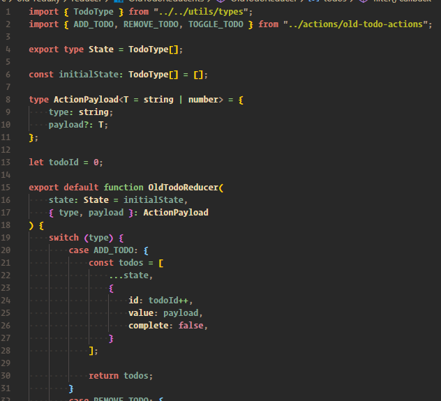

# Old Redux Way

## Folder structure

The actions directory would hold all action types, and definitions, example of actions file seen below

The reducer directory would hold the reducer for your redux state, example of reducer file seen below

    NOTE: you'd have to import all your action types (ADD_TODO, REMOVE_TODO, etc...) in order to switch on the action type. Also, with legacy redux, you have keep state immutable (always copy old state, and create a new state)
