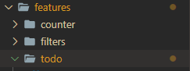
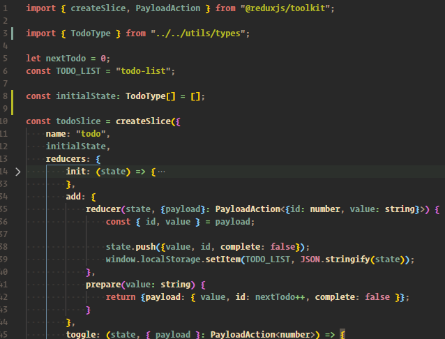

# New Redux Toolkit Way

With the introduction of redux toolkit, there are many changes...

## changes
1. folder structure

    
2. reducer (e.g.: todoSlice.ts)

    

       NOTE: notice here we mutate the state object directly.

    ```javascript
    // ability to mutate state directly with the help of immerjs
    state.push({value, id, complete: false});
    ```
